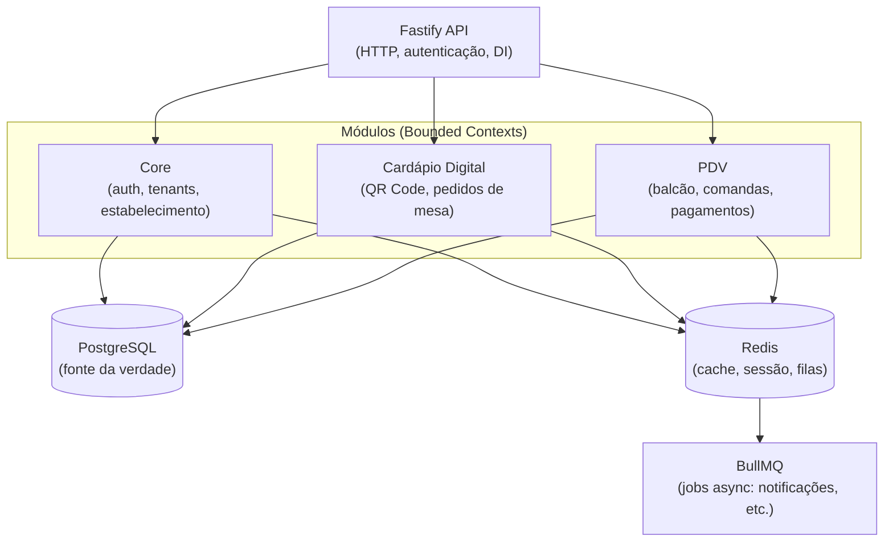

# Arquitetura

## Por que Monolito Modular

Softwares de gestão tradicionais forçam duas escolhas ruins para um negócio pequeno: um monolito acoplado (barato de operar, mas impossível de evoluir sem quebrar tudo) ou uma malha de microsserviços (evolui bem, mas cara e complexa de manter na nuvem — orçamento incompatível com o cliente-alvo do SimplifyERP).

O **Monolito Modular** resolve esse dilema:

- **Custo de infraestrutura baixo**: um único processo/deploy, um único banco de dados, sem overhead de orquestração de dezenas de serviços.
- **Lógica isolada internamente**: cada módulo de negócio (Core, Cardápio Digital, PDV, e futuramente Estoque, Financeiro, Fiscal) é um **Bounded Context** com fronteiras de código bem definidas — não um emaranhado de funções compartilhadas.
- **Integração nativa em tempo real**: como os módulos compartilham o mesmo banco de dados, atendimento, caixa e estoque "conversam" instantaneamente, sem a latência e a complexidade de comunicação assíncrona entre serviços separados.

Essa arquitetura é o que viabiliza a filosofia de negócio do SimplifyERP: **o cliente liga e desliga módulos conforme o negócio cresce**, pagando só pela complexidade que usa — sem que isso implique provisionar ou remover serviços de infraestrutura.

## Visão de alto nível

Módulos futuros (Estoque & Insumos, Gestão Financeira, Fiscal e Relatórios) entram no mesmo diagrama como novos módulos ao lado do Core, PDV e Cardápio Digital — sem exigir mudança na infraestrutura.

## Convenção de módulos

Cada módulo de negócio vive isolado em seu próprio diretório e é internamente organizado em camadas DDD (`domain`, `application`, `infrastructure`, `interface`). O detalhamento tático — Bounded Contexts, Aggregates, Entities, Value Objects e as regras de comunicação entre módulos — está em [`domain-model.md`](./domain-model.md).

## Documentos relacionados

- [`system-design.md`](./system-design.md) — fluxo de dados, papel de cada peça de infraestrutura, requisitos não-funcionais.
- [`domain-model.md`](./domain-model.md) — modelagem DDD tática por módulo.
- [`modules.md`](./modules.md) — escopo funcional de cada módulo (MVP e futuros).
- [`roadmap.md`](./roadmap.md) — fases de desenvolvimento.
